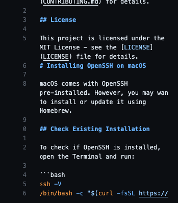
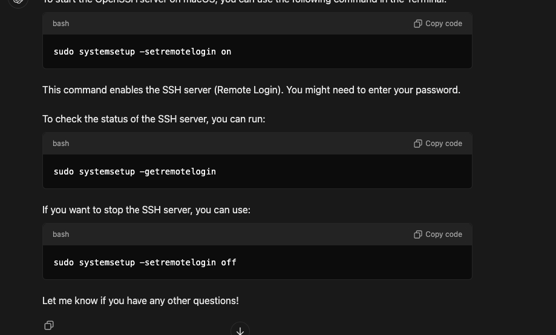

# system-installation-and-documentation-project.
# OpenSSH on macOS

OpenSSH is a suite of secure networking utilities based on the SSH protocol. This repository provides documentation for installing, configuring, and using OpenSSH on macOS.



## Overview

- [Installation on macOS](docs/macos-installation.md)
- [Configuration on macOS](docs/macos-configuration.md)
- [Usage on macOS](docs/macos-usage.md)
- [Troubleshooting](docs/troubleshooting.md)

## Quick Start

1. **Installation**: Follow the instructions in [macOS Installation](docs/macos-installation.md) to install OpenSSH.
2. **Configuration**: Learn how to configure OpenSSH for macOS in [Configuration](docs/macos-configuration.md).
3. **Usage**: Get started with common OpenSSH commands in [Usage](docs/macos-usage.md).

## Contributing

We welcome contributions! Please see our [Contributing Guidelines](CONTRIBUTING.md) for details.

## License

This project is licensed under the MIT License - see the [LICENSE](LICENSE) file for details.
# Installing OpenSSH on macOS

macOS comes with OpenSSH pre-installed. However, you may want to install or update it using Homebrew. 

## Check Existing Installation


To check if OpenSSH is installed, open the Terminal and run:


```bash
ssh -V
/bin/bash -c "$(curl -fsSL https://raw.githubusercontent.com/Homebrew/install/HEAD/install.sh)"
brew install openssh
ssh -V
brew upgrade openssh

#### `macos-configuration.md`

Provide details on configuring OpenSSH:

```markdown
# Configuring OpenSSH on macOS

OpenSSH configuration files are located in `/etc/ssh/` and `~/.ssh/`.

## SSH Server Configuration

1. **Locate the configuration file**:

   The primary SSH server configuration file is `/etc/ssh/sshd_config`. You can edit this file using a text editor like `nano` or `vim`.

   ```bash
   sudo nano /etc/ssh/sshd_config
